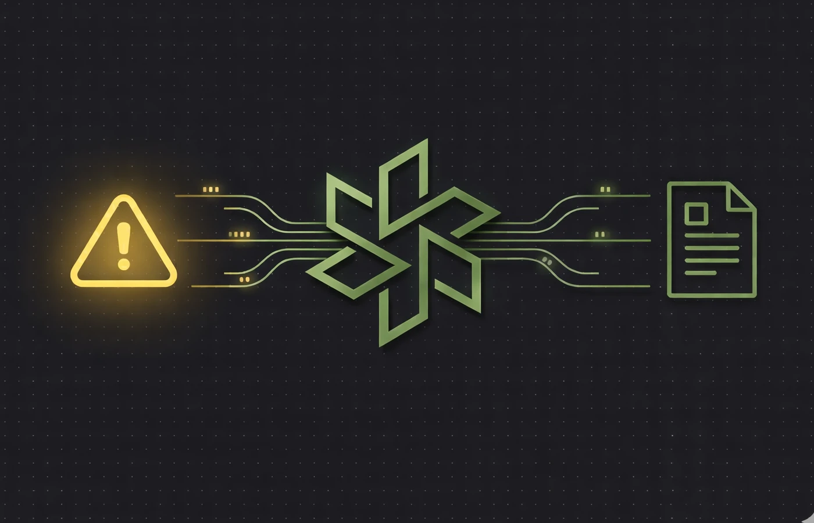
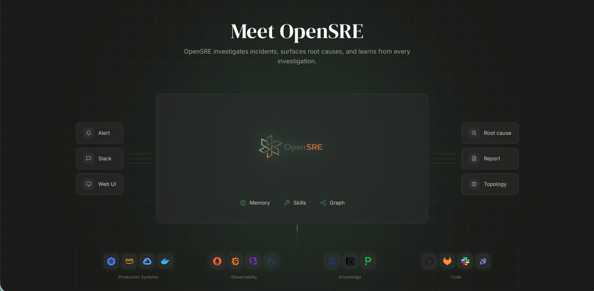
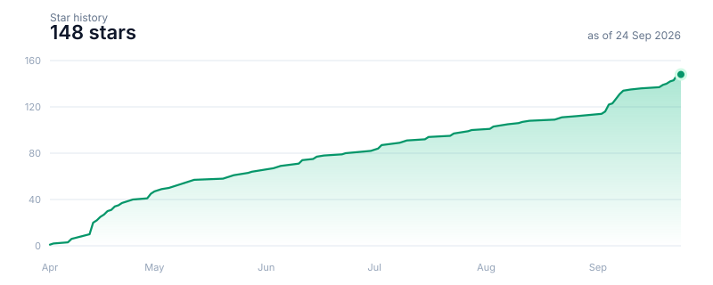

<p align="center">
  
</p>

<p align="center">
  <strong>OpenSRE — the memory-first AI SRE</strong><br />
  Self-hosted · Episodic memory · Knowledge graph · Web console · Slack &amp; Teams<br />
  <sub>opensre.in — not affiliated with Tracer / opensre.com</sub>
</p>

<p align="center">
  <a href="LICENSE"></a>
  <a href="https://github.com/swapnildahiphale/OpenSRE/stargazers"></a>
  <a href="https://github.com/swapnildahiphale/OpenSRE/network/members"></a>
  <a href="https://github.com/swapnildahiphale/OpenSRE/pulls"></a>
  <a href="https://www.opensre.in/docs"></a>
  <a href="https://www.opensre.in"></a>
</p>

OpenSRE is an open-source AI SRE agent that automatically investigates production incidents, finds root causes, and learns from every investigation. It combines **episodic memory** (remembering past incidents and what fixed them) with a **Neo4j knowledge graph** (understanding service dependencies and blast radius) and **51 production-ready skills** for tools like Datadog, Grafana, PagerDuty, Elasticsearch, Kubernetes, and AWS. Self-hosted, direct Anthropic by default (provider-agnostic via the optional LiteLLM proxy), and licensed Apache 2.0.

<p align="center">
  <a href="https://g1ctb3hnwvhw6s5v.public.blob.vercel-storage.com/how-it-works.mp4">
    
  </a>
  <br>
  <sub>Click to watch OpenSRE investigate an incident in 60 seconds</sub>
</p>

<h4 align="center">
  <a href="https://www.opensre.in">Website</a> ·
  <a href="https://www.opensre.in/docs">Docs</a> ·
  <a href="https://demo.opensre.in">Live Demo</a> ·
  <a href="CONTRIBUTING.md">Contributing</a>
</h4>

## Why OpenSRE?

| | |
|:--|:--|
| **Learns from every incident** | OpenSRE remembers past investigations — what worked, what didn't. Similar incident at 3am? It already knows the playbook. |
| **Understands your infrastructure** | Neo4j knowledge graph maps service dependencies, so the agent knows blast radius before it starts investigating. |
| **Plugs into what you already use** | 51 production skills for Datadog, Grafana, PagerDuty, Elasticsearch, Kubernetes, AWS, and more. No rip-and-replace. |

## Quick Start

```bash
git clone https://github.com/swapnildahiphale/OpenSRE.git
cd OpenSRE
cp .env.example .env
# Add your ANTHROPIC_API_KEY to .env (OpenRouter via the optional LiteLLM proxy)
make dev
```

This starts Postgres, config-service, Neo4j, sre-agent, and the web console. Migrations run automatically. Open **http://localhost:3002** and paste the admin token shown in the terminal to sign in. (LiteLLM is an optional `--profile litellm` add-on.)

> **[Full setup guide](https://www.opensre.in/docs/quick-start)** · **[Entra SSO](https://www.opensre.in/docs/sso)** · **[Slack integration](https://www.opensre.in/docs/integrations)** · **[Configuration](https://www.opensre.in/docs/configuration)**

## Architecture

<p align="center">
  
</p>

> **[→ Detailed architecture docs](https://www.opensre.in/docs/architecture)** · **[Architecture overview](docs/ARCHITECTURE.md)**

## Features

| Feature | Description |
|:--------|:------------|
| **51 Production Skills** | Elasticsearch, Datadog, Grafana, PagerDuty, K8s, AWS, Jenkins, Argo CD, and more |
| **Long-term Memory** | Neo4j episodic memory — surfaces past solutions mid-investigation via `memory-search` |
| **Knowledge Graph** | Neo4j service topology, dependency traversal, blast radius |
| **Multi-provider LLM** | Direct Anthropic by default; optional LiteLLM for OpenAI, Gemini, and more |
| **Web Console** | Investigations, memory hub, config editor |
| **Entra SSO** | Sign in to the web console with Microsoft Entra ID (token login remains) |
| **Slack Integration** | Investigate incidents directly from Slack (`make dev-slack`) |
| **Teams Bot** | Investigate incidents from Microsoft Teams (`make dev-teams`) |

**[→ See all features](https://www.opensre.in)** · **[Roadmap](https://www.opensre.in/docs)**

## Useful Commands

| Command | What it does |
|---------|-------------|
| `make dev` | Start all services (Postgres, config, Neo4j, agent, web UI) |
| `make dev-slack` | Start all services + Slack bot |
| `make dev-teams` | Start all services + Microsoft Teams bot |
| `make stop` | Stop all services |
| `make status` | Show service health status |
| `make logs` | Follow all service logs |
| `make logs-agent` | Follow sre-agent logs only |
| `make clean` | Remove containers, volumes, and images |

### Slack integration

[Create a Slack app](https://api.slack.com/apps?new_app=1), add `SLACK_BOT_TOKEN` and `SLACK_APP_TOKEN` to `.env`, and run `make dev-slack`. [Full guide](https://www.opensre.in/docs/integrations).

### Microsoft Teams

Configure `TEAMS_APP_ID`, `TEAMS_APP_PASSWORD`, and `TEAMS_TENANT_ID` in `.env`, then run `make dev-teams`. The bot listens on port **3978**. See `teams-bot/README.md`.

### Web console Entra SSO

Create a confidential **Web** Entra app (redirect `http://localhost:3002/api/auth/callback` locally), paste tenant / client id into **Admin → SSO**, and set `SSO_CLIENT_SECRET` on config-service. Keep Helm `services.webUi.oidc.enabled` off — that PKCE path is separate. Token login remains as break-glass. [Full guide](https://www.opensre.in/docs/sso) · [`docs/SSO_SETUP.md`](docs/SSO_SETUP.md).

## E2E Testing with EKS

Run OpenSRE against a real Kubernetes cluster with the [OpenTelemetry Demo](https://opentelemetry.io/docs/demo/) app to test end-to-end investigations.

### Prerequisites

- An existing EKS cluster with `kubectl` and `helm` installed
- AWS CLI configured with access to the cluster

### Setup

```bash
export EKS_CLUSTER=my-cluster
export EKS_REGION=us-west-2
make e2e-setup-eks
```

This installs the otel-demo app on your EKS cluster, sets up port-forward tunnels to Prometheus/Grafana/Jaeger, starts sre-agent and the web UI, and generates a team token you can use to sign in.

### Run fault injection tests

```bash
make e2e-test                    # Quick cart failure investigation (raw curl)
make e2e-test-cart               # Cart service fault — ~10% EmptyCart failures
make e2e-test-product            # Product catalog fault — ~5% GetProduct failures
make e2e-test-recommendation     # Recommendation service cache failure
make e2e-test-ad                 # Ad service failure — all requests fail
make e2e-test-all                # Run all 4 fault injection tests sequentially
```

Each test injects a fault into the otel-demo app via feature flags, then triggers an OpenSRE investigation to diagnose it.

### EKS commands

| Command | What it does |
|---------|-------------|
| `make e2e-setup-eks` | Full setup: otel-demo on EKS + tunnels + agent + token |
| `make e2e-teardown-eks` | Uninstall otel-demo from EKS and stop tunnels |
| `make e2e-status` | Show cluster, pods, and observability status |
| `make e2e-token` | Generate a team token for web UI access |
| `make eks-port-forward` | Start port-forward tunnels to EKS |
| `make eks-port-forward-stop` | Stop port-forward tunnels |

### Local cluster (Kind)

For testing without a cloud cluster, you can use Kind instead:

```bash
make e2e-setup       # Create Kind cluster + install otel-demo + start agent
make e2e-teardown    # Delete Kind cluster and clean up
```

## Comparing OpenSRE

**OpenSRE — the memory-first AI SRE** at [opensre.in](https://opensre.in) is not affiliated with Tracer’s OpenSRE at opensre.com.

- **[OpenSRE vs Tracer OpenSRE](https://opensre.in/compare/opensre-vs-tracer)** — team platform with episodic memory & knowledge graph
- **[vs commercial tools](https://opensre.in/compare)** — PagerDuty AI, Rootly AI, Shoreline
- **[Blog: commercial comparison](https://opensre.in/blog/opensre-vs-commercial-incident-tools)**

## Built With

OpenSRE is built on top of proven open-source technologies:

- **[Claude Agent SDK](https://github.com/anthropics/claude-agent-sdk-python)** — Agent orchestration (root investigator → specialist subagents)
- **[Neo4j](https://neo4j.com/)** — Knowledge graph for service topology and dependency traversal
- **[FastAPI](https://fastapi.tiangolo.com/)** — Backend API with SSE streaming
- **[Next.js](https://nextjs.org/)** — Web console (dashboard, memory browser, config editor)
- **[LiteLLM](https://github.com/BerriAI/litellm)** — Optional multi-provider LLM proxy
- **[PostgreSQL](https://www.postgresql.org/)** — Config and agent-run storage (episodes live in Neo4j)

## Star History

<p align="center">
  <a href="https://github.com/swapnildahiphale/OpenSRE/stargazers">
    <picture>
      <source media="(prefers-color-scheme: dark)" srcset=".github/assets/star-history-dark.svg" />
      <source media="(prefers-color-scheme: light)" srcset=".github/assets/star-history-light.svg" />
      
    </picture>
  </a>
</p>

## Contributing

We welcome contributions! See [CONTRIBUTING.md](CONTRIBUTING.md) for guidelines. Please open an issue before starting major work.

## Creator

<table>
  <tr>
    <td>
      <strong>Swapnil Dahiphale</strong> · SRE · Builder<br>
      <em>"Built by someone who's been paged at 3am."</em>
    </td>
    <td align="right">
      <a href="https://swapnil.one">
        
      </a>&nbsp;
      <a href="https://www.linkedin.com/in/swapnil2233/">
        
      </a>
    </td>
  </tr>
</table>

## License

OpenSRE is licensed under the [Apache License 2.0](LICENSE).
